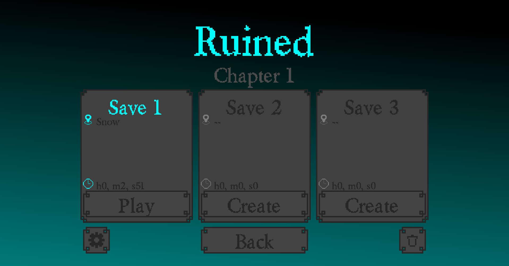
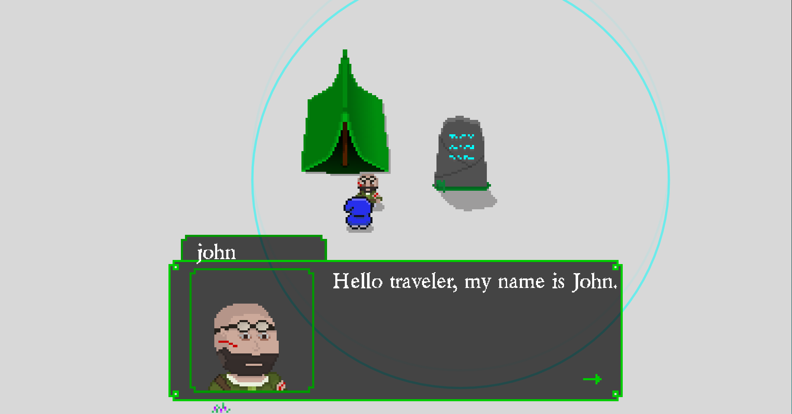
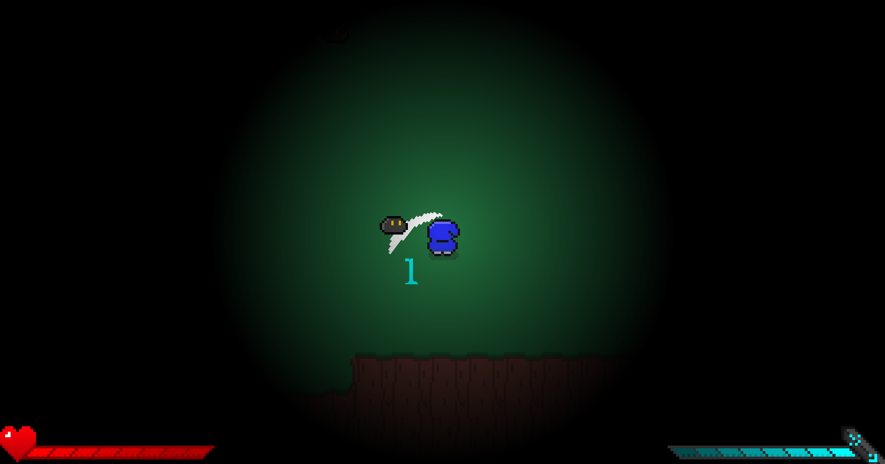
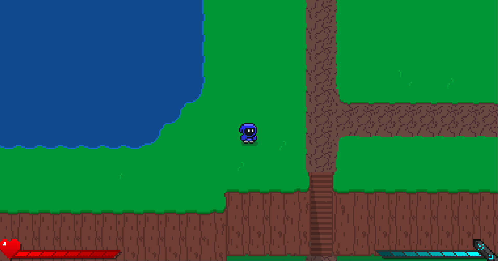

<h1>Ruined</h1>

“Ruined” the game is a hobby project that i started so i could learn Game Development. In early versions the code might not be perfect but i will try to improve every aspect of my game as i grow in skills.

<h2>Version:</h2>
<h3>Current version: <strong>Early Developer Bèta Version: 1.6</strong></h3>

This game is made in a framework called <a href="https://love2d.org/">Love2D</a> (version 11.5). and fully written in <a href="https://www.lua.org/">lua</a> (version 5.1).

<h2>How to play:</h2>

To test the game download the <a href="https://github.com/Mikert1/Ruined/releases/tag/v1.4-early-developer-beta">Latest Release</a>.

If you have love installed double click the .love file.

And if that is not the case double click the .exe file in the zip folder.

<h2>Pictures:</h2>

    
    

    
    

<h2>Beta Website:</h2>

<a href="http://mikert.com/game.html">Mikert.com</a>

<h6>Made on a Windows Laptop. Stable Versions are Tested on linux.</h6>