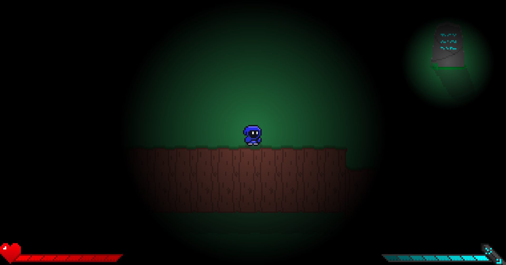

<h1>Ruined</h1>

Ruined the game is a Project of me that i started to leurn Game Development.
I started with no knowledge of Game Development so some code might be not as optimal but i do my best to make everything better when i get more knowledge.

<h2>Version:</h2>
<h3>Current version: <strong>Early Developer Bèta Version: 1.5</strong></h3>

This game is made in a framework called <a href="https://love2d.org/">Love2D</a> (version 11.5). and fully written in <a href="https://www.lua.org/">lua</a> (version 5.1).

<h2>How to play:</h2>

To test the game download the <a href="https://github.com/Mikert1/Ruined/releases/tag/v1.4-early-developer-beta">Latest Release</a>.

If you have love installed dubble click the .love file.

And if that is not the case dubble ckick the .exe file in the zip folder.
